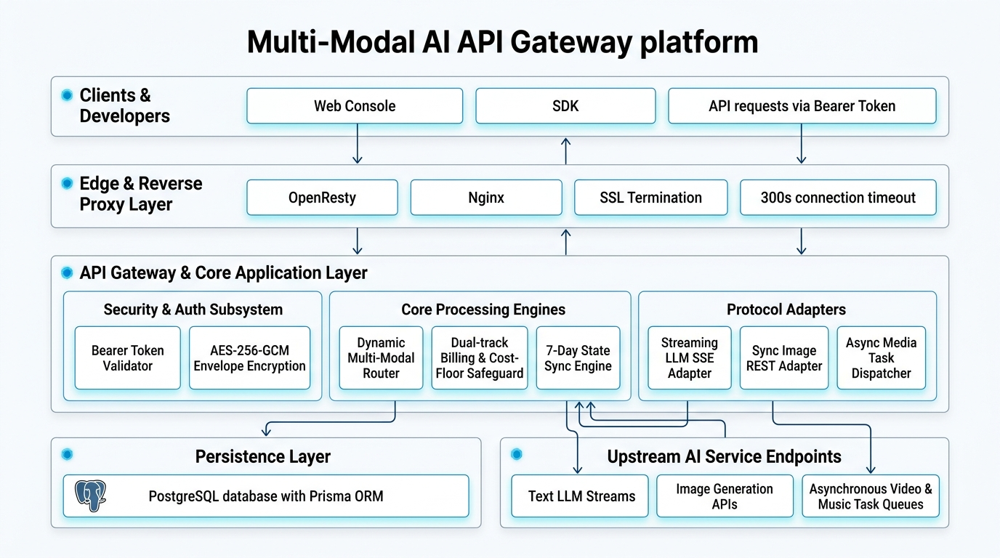
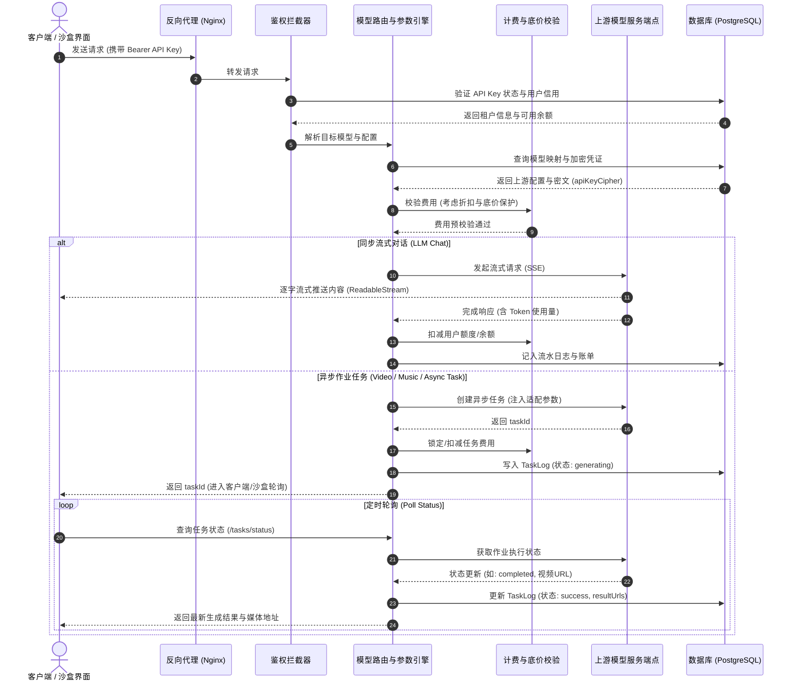
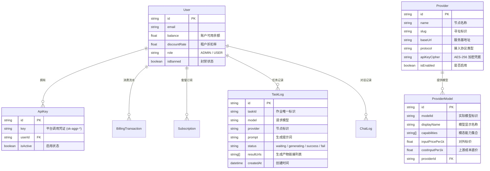

# 项目技术架构文档 (Pure Technical Architecture Document)

本文档详细描述了 **AggregateAPI** 平台的技术架构、核心模块设计、拓扑结构与关键数据流。



---

## 1. 系统总体技术拓扑图 (System Topology)

```mermaid
graph TD
    Client["客户端 / 第三方应用 / Web 控制台"] -->|HTTPS / SSE (Bearer Token)| Edge["边缘接入与反向代理层 (Nginx / OpenResty)"]
    Edge -->|长连接透传 / 300s 超时优化| AppGateway["全栈应用与网关核心 (Next.js App Router)"]

    subgraph AppGateway ["全栈网关核心服务 (Gateway Core)"]
        subgraph SecurityLayer ["安全与鉴权子系统"]
            AuthFilter["API Key 鉴权拦截器 (sk-aggr-*)"]
            CryptoEngine["AES-256-GCM 敏感凭据加解密"]
            RBAC["基于角色的权限控制 (Admin / User)"]
        end

        subgraph CoreEngines ["核心控制引擎"]
            ModelRouter["多模态路由与解析引擎<br/>• 命名空间寻址 • 参数补丁注入 • 协议转译"]
            BillingEngine["计量与计费引擎<br/>• Token 计量 • 时长阶梯 • 订阅抵扣 • 底价保护"]
            SyncEngine["状态同步与 7 天持久化引擎<br/>• 双端数据对齐 • 状态机轮询 • 全局模糊检索"]
        end

        subgraph ProtocolAdapters ["多模态协议适配器"]
            StreamLLM["流式文本对话网关 (/v1/chat/completions)<br/>• Server-Sent Events • Chunk 流式解析"]
            SyncMedia["同步图像生成网关 (/v1/images/generations)<br/>• RESTful 代理 • 内部状态轮询封装"]
            AsyncTask["通用异步任务网关 (/v1/tasks/* & /v1/jobs/*)<br/>• 异步作业创建 • 状态查询 • 回调中继"]
        end
    end

    AppGateway -->|Type-Safe Query / 连接池| DB[("关系型数据层 (PostgreSQL + Prisma ORM)")]

    subgraph UpstreamLayer ["上游模型接入层 (Upstream Model Endpoints)"]
        UpstreamLLM["文本大模型端点 (Streaming REST)"]
        UpstreamMedia["图像生成模型端点 (Sync REST)"]
        UpstreamTask["异步多媒体生成作业端点 (Async Jobs)"]
    end

    ProtocolAdapters -->|内存动态解密凭证 + 规整化转发| UpstreamLayer
```

---

## 2. 核心分层设计 (Layered Architecture)

### 2.1 边缘网络与反向代理层 (Edge & Reverse Proxy)
- **网关反向代理**：基于 OpenResty / Nginx，负责 SSL 证书卸载、安全过滤与连接分发。
- **长连接与超时调优**：
  - 配置 `proxy_read_timeout 300s;` 与 `proxy_send_timeout 300s;`，防止多模态大文件渲染及长耗时生成任务发生 504 Gateway Timeout。
  - 关闭代理缓冲 `proxy_buffering off;`，确保 SSE（Server-Sent Events）大模型输出达到逐字流式低延迟响应。

### 2.2 安全与加密子系统 (Security & Cryptography)
- **API Key 体系**：对外提供 `sk-aggr-*` 格式的高强度随机 API Key，在请求入口完成用户级绑定、有效性校验及封禁过滤。
- **信封加密机制 (AES-256-GCM)**：
  - 数据库中仅持久化经过 AES-256-GCM 加密的上游敏感密钥密文（含密文、IV 与认证标签 AuthTag）。
  - 仅在向目标端点发起转发请求前在应用内存中瞬时解密，外部调用者和数据库读写均接触不到明文。
- **会话与权限控制**：基于 NextAuth.js v5 实现 JWT 与 Session 双轨认证，严格隔离管理员后台（Admin Console）与租户沙盒（User Dashboard）。

### 2.3 动态路由与多模态转译引擎 (Model Routing & Translation Engine)
- **双命名空间寻址**：
  - **精准定向寻址**：`[节点标识]/[模型名称]`，精准指定具体上游通道。
  - **全局自动寻址**：纯 `[模型名称]`，系统自动根据数据库优先级（`sortOrder`）与可用性（`isEnabled`）智能选路与容灾。
- **参数补丁注入 (Input Patch Engine)**：
  - 自动识别不同类型模型所需的基础参数（如画幅 `aspect_ratio`、输出时长 `duration`、分辨率 `resolution`、质量 `quality` 等）。
  - 在网关层根据目标模型规则清洗冗余字段、注入缺失默认值。
- **能力自适应推导 (Smart Capability Inference)**：
  - 支持文本对话（Chat）、图像生成（Image）、视频生成（Video）、音频音乐（Music）全模态识别。
  - 当数据源标签缺失时，基于模型特征规则自动补齐能力维度，保证沙盒与路由调度精准归类。

### 2.4 计量与财务风控引擎 (Billing & Metering Engine)
- **双轨混合计费**：
  - **Token 级计量**：针对大语言模型，按 Prompt Token 与 Completion Token 分开计算。
  - **时长与按次计量**：针对生图按次计费，生视频按时长秒数阶梯计费（`基础单价 × 时长倍率`）。
- **底价熔断保护 (Cost Floor Safeguard)**：
  $$\text{FinalFee} = \max(\text{Price} \times \text{DiscountRate},\, \text{Cost})$$
  即使租户配置有大比例折扣，最终扣费金额也绝不会低于上游成本价，规避逆向亏损风险。
- **优先额度抵扣链 (Waterfall Deduction)**：
  优先消耗租户生效中的套餐订阅配额；订阅配额不足或过期时，无缝回退扣除主账户可用余额。

### 2.5 异步任务调度与 7 天持久化机制 (Async Task Engine & Persistence)
- **异步作业状态机**：
  ```text
  waiting (排队就绪) ──> generating (处理执行中) ──> success (生成成功)
                                                └──> fail (生成失败)
  ```
- **双端状态对齐**：
  - **服务端存储**：所有任务统一记录在 `TaskLog` / `ChatLog` 数据表中，附带 7 天生命周期管理。
  - **前端与沙盒对齐**：通过 `/api/v1/tasks/history` 服务端接口拉取与本地 LocalStorage 双向比对，确保跨设备登录时历史记录不丢失。
  - **多模态即时全文搜索**：支持在对话、绘画、视频和音乐记录中按提示词、模型名及运行状态进行毫秒级模糊过滤。

---

## 3. 请求生命周期数据流时序图 (Request Sequence Flow)



---

## 4. 实体数据模型关系 (Data Model ERD)



---

## 5. 核心技术栈概览 (Tech Stack Summary)

| 维度 | 选型组件 | 核心作用与技术价值 |
| :--- | :--- | :--- |
| **全栈框架** | **Next.js (App Router) + React 19** | 服务端渲染、流式响应、Server Actions 与高性能 REST 路由 |
| **编程语言** | **TypeScript 5.x** | 全链路类型完备性、强约束数据契约 |
| **关系型数据** | **PostgreSQL** | 事务保证、高一致性账务与流水存储 |
| **对象关系映射** | **Prisma ORM (v7)** | 类型安全 SQL 生成、自动连接池管理与模型迁移控制 |
| **数据加密传输** | **Node.js Crypto (AES-256-GCM)** | 凭据密文存储，端到端防篡改 |
| **用户认证** | **NextAuth.js v5 + Bcrypt** | 多会话管理、JWT 校验与管理员后台 RBAC 守卫 |
| **网关流式传输** | **Web Streams API + Fetch** | 低内存占用的管道流（PipeThrough）和 SSE 逐字中继 |
| **前置网关代理** | **OpenResty / Nginx** | 边缘反向代理、长连接超时管理与静态文件加速 |
